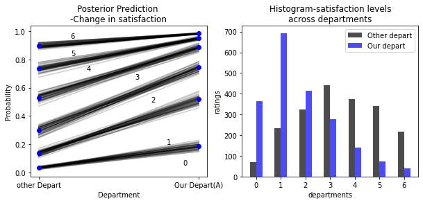

#Modeling the Likert-Scale
*Keywords: GLM, ordered logistics, Likert scale, Bayesian statistics, Pymc3*

i have done

 
## Introduction
Now and then; researchers have to use the Likert scale for measuring some variables because not all variables can be measured through engineering devices. For Example, let us consider the variable 'Happiness'. How can we measure Happiness? There are no reliable psychiatric devices that can measure happiness. But even though no psychiatric diagnoses are reliable one way to attempt measuring happiness is to use the Likert scale which is just asking the participants From a scale of 1-3, how happy are you? But these numbers cannot be interpreted as numbers from normal numbers. Indeed these numbers are defined by us and remain in the boundary defined by us i.e every other number is squeezed and limited into these scales. For Example, Even though I feel immensely happy today I cannot choose 100; I have to choose 3. 
One other thing we know about these variables is that it is not categories because 3>2>1. It means that it preserves monotonic assumption i.e I am happier than people who select 1 and 2 if I had selected 3. With these challenges and problems, someone already came up with methods to model such variables.

# How satisfied are you?:
The dataset contains Likert scales collected at a different times from each employee. The scales are from 1-7 and you as a Manager want to know that
### Hypothesis
>How satisfied are your employees compared to other departments?

## Cumulative log odds and GLM
One of the complexities that arise when trying to identify distances between categories. This information is stored as the frequencies in the data. And as these variables maintain monotonic assumptions and thus we take cumulative of such frequencies normalized. A cumulative log-odds are just the log of such frequencies. Why use Cummulative log-odds?; because we can then add a linear model to it.

Mathematically;

 
where,

:1-7 for this problem 
: intercept for ordered-categories 
  : Linear Model

## Model

where,

 be the observed ratings

*Note the code to run this model can be found in this [notebook](https://github.com/roesta07/Modeling-Likert-Scale/blob/main/Likert_scale_notebook.ipynb).

After running the model we get
|  | mean|   sd  |hdi_3%     |hdi_97% |
|--:|--: |--:	 |--:        |--:     |
|beta_{A}   |-1.94    | 0.14   |2.21      | 0.-1.68  |

## What does this mean?
Now this can be explained with different plots.

 

*fig: Change in satisfaction levels*

The plot on the right is the histogram of our prediction. Blue represents ratings from our department and gary represent ratings from other departments. Looking at the plots we can say that employees from our departments are less satisfied than other departments.The plot (on the left) indicates our predictions. In terms of ordered categories you not only get the distribution for a point but you get the distribution for the whole vector i.e for all categories often called simplex. Here the line represents the change in satisfaction level between department A and others, but an interesting thing to notice here is the distance between each category for both cases. 
